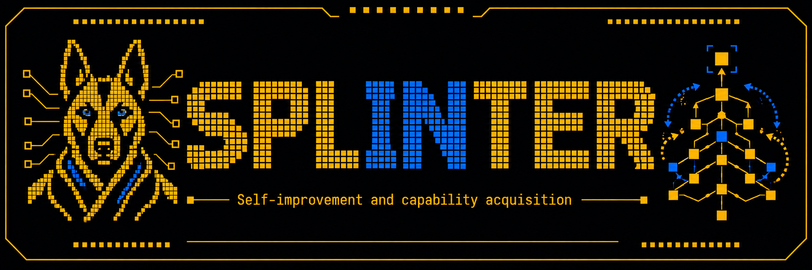

<!-- SPDX-License-Identifier: CC-BY-4.0 -->
<!-- Copyright (c) 2026 Martin Schröder <info@swedishembedded.com> -->



# Splinter

A learning agent with its own model. Tell it what to learn, in plain
language; it learns it, measures that it did, and releases a better version
of itself.

```
splinter "Learn all the facts about the STM32 reference manual from <path-to-manual>"
splinter "Learn what we can do with brain command line options"
splinter "Explain brain command line flags without interacting with brain"
```

Splinter is built on two standalone projects and replaces neither:

- **sven** runs the agent: tools, sessions, delegation, and a trustworthy
  record of what the agent did.
- **brain** runs the model: inference, training, evaluation and serving.

What Splinter releases is an ordinary brain adapter with a manifest. It runs
on plain `brain serve`, and plain sven can use it through its brain
provider; neither needs Splinter installed.

## Status

Early. The command line (`crates/splinter/README.md`) runs the learning
pipeline one stage per verb - sources, tasks, solve, verify, critique,
dataset, train, release - and `learn` runs them all as one recorded run:

```bash
splinter eval --suite anchor --freeze general.jsonl   # once: the anchor suite
splinter learn docs/p100-manual.md --goal "the P100 console and power limits"
splinter status
splinter "what baud rate does the P100 console run at?"
```

Every question Splinter writes names what it is about - the product,
document, tool or version - so that someone who has never seen the source
gets exactly one answer. A question whose answer would differ for another
product is refused, and so are two tasks that give one question different
answers.

Budget goes where learning happens: before a task's attempts become
training data, `learn` measures the policy's pass@k on it closed-book.
A task it never solves is solved once more by a teacher - the same
policy unless `--teacher` names another model - shown the source
sections the task is grounded in; the teacher's answer, once the task's
verifiers pass it, is what the policy learns a new fact from. `learn`
keeps the tasks the policy fails at least sometimes and has a verified
answer to - its own or the teacher's - and drops those it always solves
(nothing to learn) and those nobody answered verifiably (nothing to learn
from). The training records are the student's: the instruction alone and
the verified answer, never the passage the teacher saw. The training set
is capped per concept, task kind and verification strength; `splinter
status` lists the concepts the policy has mastered least, from its
closed-book solves alone; and concepts the release gate sees forgotten are
queued for new tasks.

What the policy is trained on is what it sees when it answers: every
solve, `ask`, judge, critique and gate probe runs under one short system
prompt of Splinter's own, and every training record starts with that same
system turn.

Every stage stores what it makes under the state root by content address,
so any stage can be rerun or inspected alone (`splinter runs show`,
`splinter experiences show --graph`). Every model runs locally unless a
`remote:` model is named with `--allow-remote`.

Local models share the device: the policy, a candidate and the champion
it is measured against are one base with different LoRA adapters, so one
copy of the base is resident and each generation runs with its own
model's adapter attached. Training and the release gate's `brain serve`
check load their own copy, so every resident base is released before
either starts and loaded again by the next model use.

A trained candidate continues the current release (the champion) - by
supervised fine-tuning with a replay of what earlier releases learned, or
by DPO on pairs preferring a verified answer over a failed one - and
becomes the policy only if the release gate measures that it improved on
the new material's held-out questions - the facts it was trained on asked
in other words, which `learn` has the generator model write for each task
kept and which are never trained on - kept what earlier releases
learned, held a frozen anchor suite of general tasks, and runs on plain
`brain serve` with the same answers (to within the numerical noise of
two processes decoding one model). A held-out question
the candidate was trained on (the same question, or a near duplicate,
among its training records) is left out of those measurements and
counted as leaked. An executable check passes only when it is seen to run to its
end, so a solution that exits before its check cannot pass, and
`splinter experiences replay` re-runs an experience's code calls in its
recorded environment to confirm what it observed.
Each release is an immutable adapter with a manifest of every number the
gate measured; `splinter rollback default` returns to the previous one.

Every artifact traces both ways: `splinter lineage <ID>` walks from an
answer, a release, a dataset or any other stored artifact up to where it
came from - down to the source, part and byte range each task is grounded
in, with the bytes themselves - and down to everything that came from it.

## Building

sven and brain are git dependencies at the revisions pinned in `Cargo.lock`:

```bash
make build     # release build of every package
make test      # every test; no model, GPU or network needed
make check     # all gates: text hygiene, headers, fmt, clippy -D warnings, lock sources
```

To build against local checkouts instead - to change sven or brain and
Splinter together - write the gitignored local override once:

```bash
make local SVEN_DIR=<sven-checkout> BRAIN_DIR=<brain-checkout>
```

Builds then compile the checkouts' working trees, offline, without touching
`Cargo.toml` or `Cargo.lock`. `make lock` re-pins the lock to those
checkouts' HEADs; push those commits before sharing the lock. Delete
`.cargo/config.toml` to go back to the remotes.

The policy is Qwen3-0.6B from brain's model store by default
(`BRAIN_QWEN_WEIGHTS` names another checkpoint). One 24 GB GPU holds its
base for serving and trains LoRA adapters on it at agent-trajectory
lengths - tens of thousands of tokens per record - which is what learning
from agent experience needs. Qwen3-1.7B also trains on one such GPU, at
shorter records; larger bases need more memory than one card has.

Runtime state (sources, tasks, experiences, datasets, candidates,
releases, answers, runs) lives under `~/.sven/splinter`, Sven's home in a namespace
of its own (override: `--state DIR` or `SPLINTER_STATE`).

## License

Apache-2.0. See `LICENSE`.
